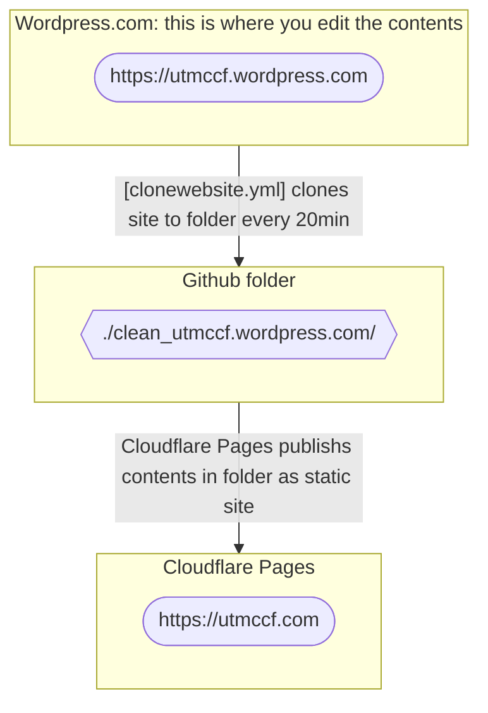

```mermaid
flowchart TD
subgraph s1["Wordpress.com: this is where you edit the contents"]
	n1(["https://utmccf.wordpress.com"]) 
end
s1--"[clonewebsite.yml] clones site to folder every 20min"-->s2
subgraph s2["Github folder"]
  n3{{"./clean_utmccf.wordpress.com/"}}
end
s2--Cloudflare Pages publishs contents in folder as static site-->s3
subgraph s3["Cloudflare Pages"]
 n4(["https://utmccf.com"])
end
```

