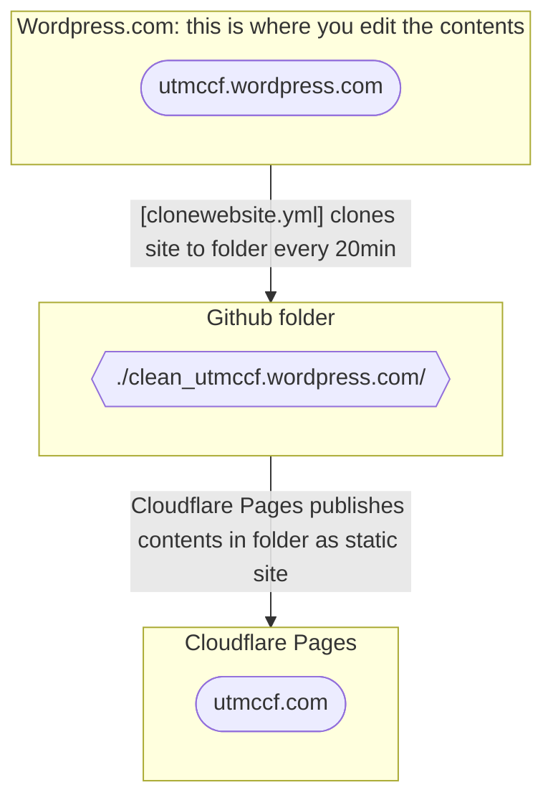

## Using link shortener

1. Visit [tinyurl.com](https://tinyurl.com)
2. Use `utmccftiny-` as the alias (e.g., <b>utmccftiny-<em>2024easter</em></b>).
3. Create Link. The link will appear as utmccf.com/tiny/*something* (e.g., utmccf.com/tiny/***2024easter***)

## Infrastructure documentation

